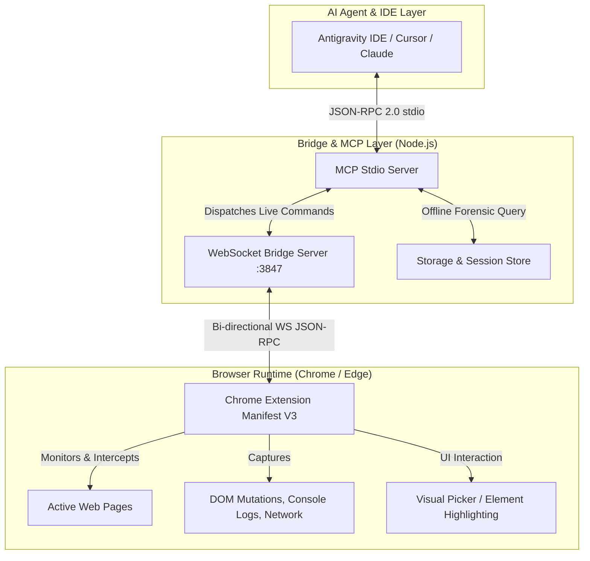

# 🤖 McpDOM + Browser Forensic Platform — AI Agent & Developer Master Guide

> **Welcome Agent / Developer!**
> This document is your comprehensive architectural and operational guide to understanding, building, running, testing, and extending the **McpDOM Browser Forensic Platform (v3.0.0)**.

> **v3 evolution**: the platform now exposes **121 MCP tools** (47 preserved + 74 new),
> a DOM mutation engine with transactions and undo/redo, a project knowledge system
> with agent handoff packages, human-like interaction profiles, responsive testing,
> 27 DOM analyzers and built-in tool discovery. Deep references:
> `docs/ARCHITECTURE.md`, `docs/MCP_TOOLS.md`, `docs/CAPABILITY_MATRIX.md`,
> `docs/TROUBLESHOOTING.md`, and the 17 skills under `.agents/skills/`.

---

## 📌 1. Project Overview & Mission

**McpDOM Browser** is a production-grade dual-environment platform that bridges AI agents (Claude, Gemini, Antigravity IDE, Cursor) directly to live web browsers (Chrome / Edge / Brave). It serves two primary capabilities:

1. **Live Browser Control, DOM Intelligence & Visual Forensics** (now with DOM mutation transactions, JavaScript execution with explicit outcome states, reversible viewport control, human-like interaction profiles, command sequences/recording/replay and 27 DOM analyzers):
   - Live DOM hierarchy inspection, subtree extraction, bounding box & computed style inspection.
   - Visual element selection via **`Ctrl + Shift + Click`** on any webpage.
   - Live synthesized interactions (`click`, `type`, `focus`, `blur`, `scroll`, `hover`, `press_key`, `select_option`).
   - High-fidelity viewport and cropped element screenshots with Device Pixel Ratio (DPR) preservation.
   - Continuous mutation observation to detect unmounting, disappearing elements, and layout destruction.
   - Real-time tab and extension management (list tabs, focus, reload, console logs, network requests).

2. **Historical Forensics & Time-Travel Debugging**:
   - Microsecond-accurate DOM mutation recording ($T_0 \to T_n$).
   - Full virtual DOM state reconstruction at any arbitrary timestamp.
   - Structural DOM diffing between two points in time ($T_1 \leftrightarrow T_2$).
   - Automated root-cause diagnostics for disappearing UI components, parent subtree replacements, and runtime script errors.

---

## 🏛️ 2. Dual-Environment Architecture



### Key Architectural Components:
1. **Chrome Extension (`src/extension/` & `chrome-extension/`)**:
   - `src/extension/background/service-worker.ts`: Background service worker managing tab lifecycles, extension messaging, and WebSocket connection to Bridge (`ws://localhost:3847/extension`).
   - `src/extension/content/`: Injected content script tracking DOM mutations via `MutationObserver`, element picker (`Ctrl + Shift + Click`), and synthetic interaction execution.
2. **WebSocket Bridge Server (`src/mcp/bridge-server.ts` & `bin/bridge-server.js`)**:
   - Listens on `http://localhost:3847` and `ws://localhost:3847`.
   - Dispatches live commands from MCP tools to connected browser tabs and returns evaluated DOM data.
3. **MCP Stdio Server (`src/mcp/server.ts` & `bin/mcp-server.js`)**:
   - Implements the official Model Context Protocol (JSON-RPC 2.0 over stdio).
   - Exposes **43 distinct tools** directly to AI agents.
4. **Web UI Client (`src/ui/`)**:
   - Time-travel debugger UI allowing human developers to scrub through recorded timelines visually.

---

## 🛠️ 3. Complete 43 MCP Tools Reference

### 🌐 Live Browser Control, Tab & Extension Management (22 Tools)
| Tool Name | Description | Key Parameters |
| :--- | :--- | :--- |
| `list_tabs` | List all open browser tabs with IDs, titles, URLs, active state | `{}` |
| `focus_tab` | Bring a specific browser tab to focus and foreground | `tabId` |
| `reload_tab` | Reload a specific tab with optional cache bypass | `tabId`, `bypassCache` |
| `close_tab` | Close a specific browser tab | `tabId` |
| `open_tab` | Open a new tab with specified URL | `url`, `active` |
| `list_extensions` | List all installed browser extensions with status | `{}` |
| `reload_extension` | Reload an extension under development | `extensionId` |
| `get_tab_console_logs` | Retrieve live intercepted console logs and errors | `tabId`, `level`, `searchQuery`, `limit` |
| `get_tab_network_requests` | Retrieve live intercepted fetch/XHR network requests | `tabId`, `method`, `status`, `onlyErrors` |
| `inspect_live_page` | Inspect page URL, title, viewport dimensions, readyState | `tabId` |
| `inspect_live_element` | Deep inspection of bounds, styles, computed CSS, ARIA | `tabId`, `selector`, `nodeId` |
| `get_selected_element` | Retrieve element picked with `Ctrl + Shift + Click` | `tabId` |
| `start_element_picker` | Turn on interactive hover element picker in browser | `tabId`, `highlightColor` |
| `stop_element_picker` | Turn off interactive element picker | `tabId` |
| `capture_page_screenshot` | Capture full visible viewport screenshot with geometry | `tabId`, `format` (`png`/`jpeg`) |
| `capture_element_screenshot` | Capture element-bounded cropped screenshot with DPR | `tabId`, `selector`, `nodeId` |
| `interact_with_element` | Perform synthetic click, type, hover, focus, scroll, key | `tabId`, `action`, `selector`, `text` |
| `start_element_observation`| Start focused continuous mutation observation on element | `tabId`, `selector`, `nodeId` |
| `stop_element_observation` | Stop observation and return mutation root-cause bundle | `tabId` |
| `get_live_dom_snapshot` | Capture current complete live virtual DOM snapshot | `tabId`, `format` (`html`/`json`) |
| `get_live_dom_subtree` | Reconstruct and extract live HTML structure of subtree | `tabId`, `selector`, `nodeId` |
| `get_element_visual_state` | Inspect layout occlusion, clipping, opacity, z-index | `tabId`, `selector`, `nodeId` |

### 🕰️ Historical Forensics & Time-Travel Debugging (21 Tools)
| Tool Name | Description | Key Parameters |
| :--- | :--- | :--- |
| `list_sessions` | List recorded forensic sessions with stats and metadata | `limit` |
| `get_session` | Retrieve full metadata and health for a session | `sessionId` |
| `export_session` | Export session bundle as portable JSON | `sessionId` |
| `import_session` | Import session bundle from raw JSON string | `bundleJson` |
| `delete_session` | Delete a recorded debugging session | `sessionId` |
| `get_timeline` | Retrieve chronological event timeline | `sessionId`, `filter`, `range` |
| `get_events` | Fetch detailed events with pagination | `sessionId`, `offset`, `limit` |
| `get_events_around` | Retrieve cluster of events around a timestamp | `sessionId`, `timestamp`, `windowMs` |
| `get_dom_state` | Reconstruct full virtual DOM at timestamp $T$ | `sessionId`, `timestamp` |
| `get_dom_node` | Inspect specific virtual DOM node at timestamp $T$ | `sessionId`, `nodeId`, `timestamp` |
| `get_dom_subtree` | Extract virtual DOM subtree at timestamp $T$ | `sessionId`, `nodeId`, `timestamp` |
| `diff_dom` | Calculate structural tree diff between $T_1$ and $T_2$ | `sessionId`, `t1`, `t2` |
| `trace_element` | Trace complete lifecycle of an element from birth to death| `sessionId`, `nodeId`, `selector` |
| `find_disappearing_elements`| Detect all elements unmounted or destroyed | `sessionId`, `thresholdMs` |
| `why_did_element_disappear`| Automated root-cause analysis for disappearing element | `sessionId`, `nodeId` |
| `get_diagnostics` | Aggregate console errors, exceptions, and anomalies | `sessionId` |
| `get_network_events` | Retrieve recorded HTTP/WebSocket network traces | `sessionId` |
| `get_screenshots` | Retrieve recorded visual frame captures | `sessionId` |
| `annotate_session` | Add persistent developer note/tag to session | `sessionId`, `note`, `tag` |
| `get_annotations` | Retrieve all developer annotations | `sessionId` |
| `get_recording_health` | Inspect recorder dropped frames and health metrics | `sessionId` |

---

## 📁 4. Project Directory Structure

```text
mcpdom-browser/
├── .agents/                                # AI Agent configurations & skills
│   ├── mcp_config.json                     # Agent MCP configuration file (43 tools)
│   ├── rules/
│   │   └── AGENT_RULES.md                  # Development and coding standards
│   ├── plugins/browser-forensics/          # Plugin bundle for agent environments
│   └── skills/browser-forensics/
│       └── SKILL.md                        # Master AI Agent operational skill guide
├── bin/
│   ├── cli.js                              # Universal CLI runner (dom-antigravity)
│   ├── mcp-server.js                       # Stdio MCP Server entrypoint
│   └── bridge-server.js                    # WebSocket Bridge Server entrypoint
├── chrome-extension/                       # Ready-to-load unpacked Chrome Extension
│   ├── manifest.json
│   └── dist/
├── dist/                                   # Compiled JavaScript bundles (client + server + extension)
├── operational-tests/                      # Operational test suite and JSON-RPC fixtures
├── scripts/                                # Automation, build, and validation scripts
│   ├── build-extension.js                  # Standalone IIFE extension compiler
│   ├── build-portable-exe.js               # Node.js SEA (Single Executable) packager
│   ├── generate-mcp-schemas.js             # MCP tool schema generator
│   └── run-operational-suite.js            # Operational stdio test suite
├── src/                                    # Full TypeScript source code
│   ├── core/                               # DOM tracking, privacy engine, search index
│   ├── diff/                               # DOM structural diff engine
│   ├── extension/                          # Chrome Extension background, content, devtools
│   ├── lifecycle/                          # Element lifecycle & disappearing analyzer
│   ├── mcp/                                # MCP server, bridge server, tool definitions & handlers
│   ├── reconstruction/                     # DOM snapshot reconstruction
│   ├── replay/                             # Event replay simulation engine
│   ├── storage/                            # Session persistence engine
│   ├── types/                              # TypeScript interfaces & types
│   └── ui/                                 # Web client debugger UI
├── tests/                                  # Unit, integration, and E2E vitest suites
├── package.json
├── tsconfig.json
├── vite.config.ts
├── vitest.config.ts
├── Start-Bridge-Server.bat                 # One-click Bridge Server launcher
├── Check-Bridge-Status.bat                 # One-click status checker
├── Build-All.bat                           # One-click build runner
└── Install-Dependencies.bat                # One-click dependency installer
```

---

## 🚀 5. Quickstart & Development Workflow

### Step 1: Install Dependencies
```bash
npm install
```
*(Or double-click `Install-Dependencies.bat` on Windows)*

### Step 2: Build the Project
```bash
npm run build
```
*(Or double-click `Build-All.bat`)*

This compiles:
- The Web Client UI into `dist/`
- The Standalone Chrome Extension scripts into `dist/extension/` and syncs them to `chrome-extension/`
- The MCP and Bridge servers into `dist/server/`

### Step 3: Run Unit & Integration Tests
```bash
npm run test:unit
```
*(Or double-click `Run-Tests.bat`)*

### Step 4: Start the WebSocket Bridge Server
```bash
node bin/bridge-server.js
# OR
npm run bridge
```
*(Or double-click `Start-Bridge-Server.bat`)*
The Bridge Server will start on `http://localhost:3847`.

### Step 5: Load the Chrome Extension
1. Open Google Chrome, Edge, or Brave.
2. Navigate to `chrome://extensions`.
3. Enable **Developer mode** (toggle in upper-right corner).
4. Click **Load unpacked**.
5. Select the `chrome-extension/` directory (or the project root).
6. Open any webpage (e.g., Google Meet, YouTube, your web app).
7. Press `Ctrl + Shift + Click` on any element to test live element selection!

---

## 🤖 6. AI Agent Integration (.agents / MCP)

If you are an AI agent running in **Antigravity IDE**, **Cursor**, **Claude Desktop**, or **Cline**:
The `.agents/mcp_config.json` file in this repository is already pre-configured to launch the MCP server via `node ./bin/mcp-server.js` with all 43 tools authorized.

To manually register in Claude Desktop or Cursor:
```json
{
  "mcpServers": {
    "browser-forensics": {
      "command": "node",
      "args": ["<PATH_TO_PROJECT_ROOT>/bin/mcp-server.js"]
    }
  }
}
```

---

## 💡 7. Guidelines for Extending & Adding New Tools

1. **Define the Tool**: Add its name, description, and JSON schema to `src/mcp/tools-definition.ts`.
2. **Implement Handler**:
   - For offline/storage tools: Add logic to `src/mcp/tools-handler.ts`.
   - For live browser commands: Add dispatch logic to `src/mcp/live-tools-handler.ts` and handle the corresponding browser action in `src/extension/content/` or `src/extension/background/service-worker.ts`.
3. **Register in CLI**: Add the tool name to `ALL_43_TOOLS` in `bin/cli.js`.
4. **Compile & Test**: Run `npm run build` and `npm run test:unit`.

Happy Coding & Debugging! 🚀
