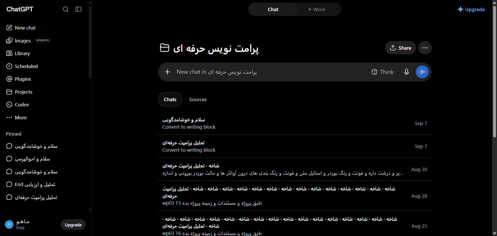

# مستندات دام: 00-master-architecture-and-full-dom

این پوشه شامل ساختار کامل DOM، استایل‌های محاسبه‌شده، تصاویر واقعی و راهنمای تزریق UI برای بخش **00-master-architecture-and-full-dom** می‌باشد.

---

## 📌 تصویر واقعی از محیط زنده (Real Snapshot):


---

## 🎯 سلکتورهای کلیدی:
- **سلکتور کانتینر:** `div[data-testid="00-master-architecture-and-full-dom"], main, div.stage-layout`
- **مختصات:** Full Component Viewport

---

## 🛠️ راهنمای تزریق UI سفارشی در اکستنشن کروم:
```javascript
const container = document.querySelector('main, div.stage-layout');
if (container && !container.dataset.customInjected) {
  container.dataset.customInjected = 'true';
  const myEl = document.createElement('div');
  myEl.className = 'my-custom-extension-widget';
  myEl.innerHTML = '<span>⚡ ماژول سفارشی فعال شد</span>';
  container.prepend(myEl);
}
```
