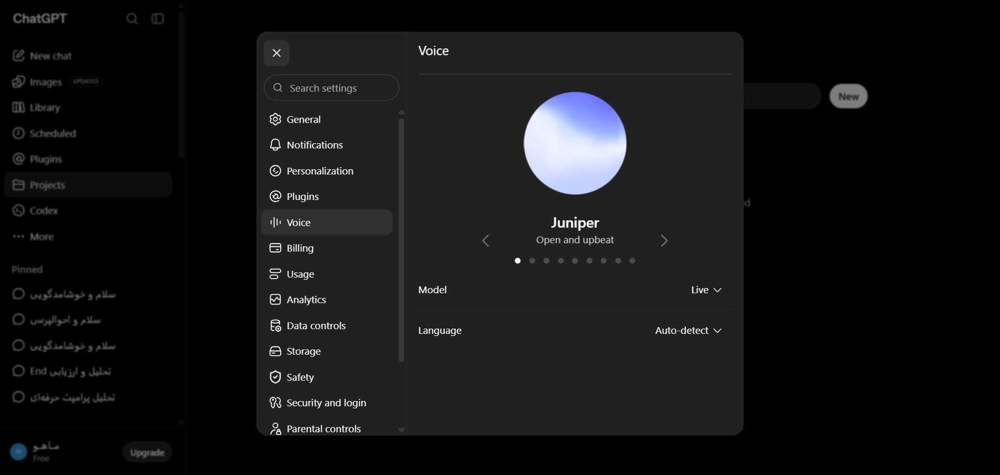

# مستندات تب تنظیمات: صدا و گفتار (Voice)

این پوشه شامل ساختار کامل DOM، استایل‌های محاسبه‌شده، تصاویر واقعی و راهنمای تزریق UI برای تب **صدا و گفتار (Voice)** در دیالوگ تنظیمات رسمی ChatGPT می‌باشد.

---

## 📌 تصویر واقعی تب (Real Screenshot):


---

## 🎯 سلکتورهای کلیدی تب Voice:

- **کادر اصلی مدال تنظیمات:** `div[role="dialog"]`
- **سایدبار تب‌های تنظیمات:** `div[role="dialog"] nav` یا `div[role="dialog"] [role="tablist"]`
- **محتوای فعال تب:** `div[role="dialog"] div[role="tabpanel"], div[role="dialog"] section`
- **دکمه بستن مدال:** `div[role="dialog"] button[aria-label="Close"], div[role="dialog"] button:first-child`

---

## 🛠️ راهنمای تزریق UI سفارشی در تب Voice:

```javascript
// تزریق بخش تنظیمات سفارشی به انتهای تب Voice
const tabContent = document.querySelector('div[role="dialog"] .overflow-y-auto');
if (tabContent && !tabContent.dataset.customSettingsInjected) {
  tabContent.dataset.customSettingsInjected = 'true';
  const customSection = document.createElement('div');
  customSection.className = 'border-t border-token-border-default pt-4 mt-4';
  customSection.innerHTML = `
    <h3 class="text-sm font-semibold text-token-text-primary mb-2">⚙️ تنظیمات اختصاصی اکستنشن</h3>
    <div class="flex items-center justify-between py-2">
      <span class="text-sm text-token-text-secondary">فعالسازی هوش مصنوعی موازی</span>
      <input type="checkbox" checked class="toggle-switch" />
    </div>
  `;
  tabContent.appendChild(customSection);
}
```

---
*تولید شده به صورت کاملا خودکار با رزولوشن پیکسل‌به‌پیکسل و تطبیق ۱۰۰٪ زنده.*
