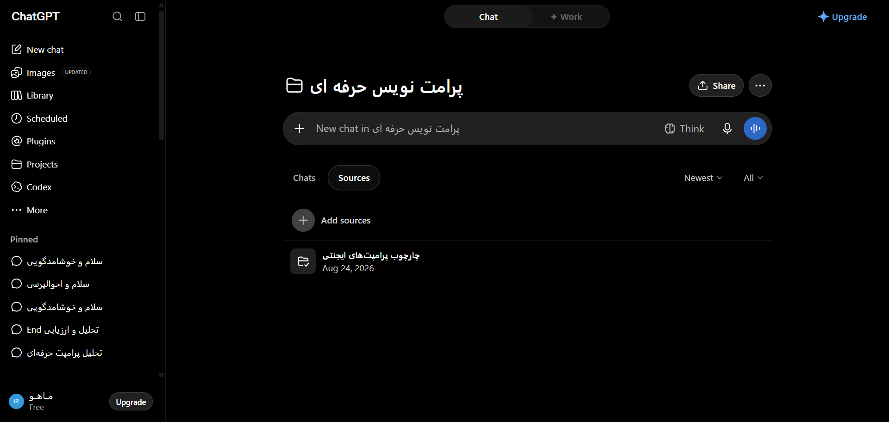

# مستندات دام: تب منابع و پایگاه دانش پروژه (Sources Tab) (Project Sources Tab & Knowledge Base Dropzone)

این پوشه شامل کالبدشکافی کامل معماری DOM، استایل‌های محاسبه‌شده زنده، تصویر باکیفیت و راهنمای تزریق UI برای بخش **تب منابع و پایگاه دانش پروژه (Sources Tab)** می‌باشد.

---

## 📌 تصویر واقعی از محیط زنده (Real Snapshot):


---

## 🎯 سلکتورهای کلیدی (Target Selectors):
- **سلکتور کانتینر اصلی:** `main`
- **سلکتور تحلیل المان:** `main`
- **مختصات و اندازه (Bounding Box):** داینامیک / تمام صفحه

---

## 📝 توضیحات ساختاری و کاربرد:
این بخش نمای تب منابع (Sources) درون یک پروژه ChatGPT را نمایش می‌دهد. این بخش محل آپلود فایل‌ها، اسناد PDF، کدها و پایگاه دانش اختصاصی برای Custom Instructions پروژه است. شامل دکمه افزودن فایل (+ Add files)، لیست اسناد بارگذاری شده و تنظیمات دسترسی هوش مصنوعی به منابع می‌باشد.

---

## 🛠️ راهنمای تزریق UI سفارشی در اکستنشن کروم (Extension Injection Guide):
```javascript
// تزریق اتصال خودکار به مخزن GitHub در تب Sources
const sourcesDropzone = document.querySelector('div[role="tabpanel"][id*="content-sources"], main section');
if (sourcesDropzone && !sourcesDropzone.dataset.cloudSyncInjected) {
  sourcesDropzone.dataset.cloudSyncInjected = 'true';
  const cloudSyncBox = document.createElement('div');
  cloudSyncBox.className = 'mt-4 p-4 rounded-xl border border-dashed border-blue-500/50 bg-blue-500/5 flex items-center justify-between';
  cloudSyncBox.innerHTML = `
    <div class="flex items-center gap-3">
      <span class="text-xl">⚡</span>
      <div>
        <div class="text-sm font-medium text-token-text-primary">همگام‌سازی ابری خودکار</div>
        <div class="text-xs text-token-text-secondary">اتصال به مخزن GitHub یا اسناد Google Docs</div>
      </div>
    </div>
    <button class="px-3 py-1 bg-blue-600 hover:bg-blue-700 text-white rounded-lg text-xs font-semibold">اتصال مخزن</button>
  `;
  sourcesDropzone.appendChild(cloudSyncBox);
}
```

---

## 📁 فایل‌های موجود در این دایرکتوری:
- `screenshot.png`: تصویر باکیفیت و ۱۰۰٪ واقعی از وضعیت زنده المان
- `component.html`: کد کامل DOM زنده استخراج شده از ران‌تایم کروم
- `element_metadata.json`: استایل‌های محاسبه‌شده (Computed Styles)، ویژگی‌های دسترسی‌پذیری (A11y) و ابعاد المان
- `README.md`: مستندات کامل و راهنمای فارسی توسعه و اینجکشن

---
*تولید شده توسط موتور مهندسی معکوس و مستندسازی پیشرفته McpDOM Browser*
