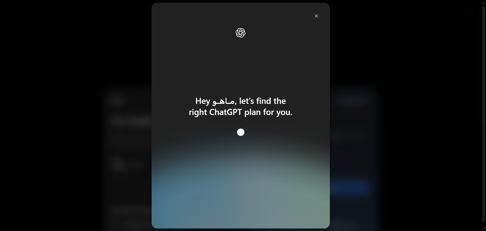

# مستندات دام: دیالوگ تنظیمات و مدیریت پروژه (Project Options Dialog) (Project Options & Management Dialog / Dropdown Menu)

این پوشه شامل کالبدشکافی کامل معماری DOM، استایل‌های محاسبه‌شده زنده، تصویر باکیفیت و راهنمای تزریق UI برای بخش **دیالوگ تنظیمات و مدیریت پروژه (Project Options Dialog)** می‌باشد.

---

## 📌 تصویر واقعی از محیط زنده (Real Snapshot):


---

## 🎯 سلکتورهای کلیدی (Target Selectors):
- **سلکتور کانتینر اصلی:** `div[role="dialog"], div[data-radix-popper-content-wrapper]`
- **سلکتور تحلیل المان:** `div[role="dialog"], div[data-radix-popper-content-wrapper]`
- **مختصات و اندازه (Bounding Box):** داینامیک / تمام صفحه

---

## 📝 توضیحات ساختاری و کاربرد:
این بخش دیالوگ و تنظیمات کامل پروژه را نشان می‌دهد که با کلیک روی دکمه سه نقطه (...) در هدر پروژه باز می‌شود. شامل فیلد ویرایش نام پروژه، ویرایش دستورالعمل‌های سفارشی پرامپت (Custom Instructions)، آیکون پروژه، مدیریت دسترسی‌ها و کلید حذف پروژه (Delete project) است.

---

## 🛠️ راهنمای تزریق UI سفارشی در اکستنشن کروم (Extension Injection Guide):
```javascript
// تزریق دکمه «تولید خودکار پرامپت سیستمی با هوش مصنوعی» در دیالوگ تنظیمات پروژه
const projectDialog = document.querySelector('div[role="dialog"]');
if (projectDialog && !projectDialog.dataset.aiPromptGenInjected) {
  projectDialog.dataset.aiPromptGenInjected = 'true';
  const aiBtn = document.createElement('button');
  aiBtn.className = 'btn btn-primary px-3 py-1.5 text-xs rounded-lg mt-2 flex items-center gap-1.5';
  aiBtn.innerHTML = '✨ تولید هوشمند پرامپت سیستمی';
  aiBtn.onclick = () => alert('پرامپت استاندارد برای پروژه تولید و جایگذاری شد!');
  projectDialog.querySelector('textarea, form')?.parentElement?.appendChild(aiBtn);
}
```

---

## 📁 فایل‌های موجود در این دایرکتوری:
- `screenshot.png`: تصویر باکیفیت و ۱۰۰٪ واقعی از وضعیت زنده المان
- `component.html`: کد کامل DOM زنده استخراج شده از ران‌تایم کروم
- `element_metadata.json`: استایل‌های محاسبه‌شده (Computed Styles)، ویژگی‌های دسترسی‌پذیری (A11y) و ابعاد المان
- `README.md`: مستندات کامل و راهنمای فارسی توسعه و اینجکشن

---
*تولید شده توسط موتور مهندسی معکوس و مستندسازی پیشرفته McpDOM Browser*
