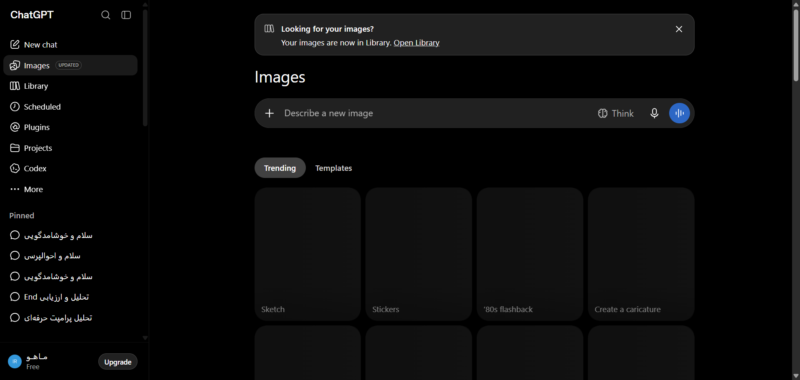

# مستندات دام: بخش پلاگین‌ها و کاوشگر GPTها در سایدبار (Plugins / GPTs Hub) (Sidebar ... More / Plugins & GPTs Hub)

این پوشه شامل کالبدشکافی کامل معماری DOM، استایل‌های محاسبه‌شده زنده، تصویر باکیفیت و راهنمای تزریق UI برای بخش **بخش پلاگین‌ها و کاوشگر GPTها در سایدبار (Plugins / GPTs Hub)** می‌باشد.

---

## 📌 تصویر واقعی از محیط زنده (Real Snapshot):


---

## 🎯 سلکتورهای کلیدی (Target Selectors):
- **سلکتور کانتینر اصلی:** `nav, div[data-radix-popper-content-wrapper], div[role="dialog"]`
- **سلکتور تحلیل المان:** `nav`
- **مختصات و اندازه (Bounding Box):** داینامیک / تمام صفحه

---

## 📝 توضیحات ساختاری و کاربرد:
این بخش منوی ناوبری ابزارها و پلاگین‌ها در سایدبار را نشان می‌دهد. شامل بخش‌های کتابخانه تصاویر (Images Library)، کاوشگر مدل‌ها و GPTهای اختصاصی، و پیوندهای میان‌بر سریع ناوبری است.

---

## 🛠️ راهنمای تزریق UI سفارشی در اکستنشن کروم (Extension Injection Guide):
```javascript
// تزریق دکمه میان‌بر اختصاصی به ابزارهای هوش مصنوعی دلخواه در ناوبری سایدبار
const navList = document.querySelector('nav');
if (navList && !navList.dataset.quickShortcutsInjected) {
  navList.dataset.quickShortcutsInjected = 'true';
  const shortcutLink = document.createElement('div');
  shortcutLink.className = 'flex items-center gap-2 px-3 py-2 text-sm text-token-text-primary hover:bg-token-surface-hover rounded-lg cursor-pointer';
  shortcutLink.innerHTML = '<span>🚀</span><span>دستیار برنامه‌نویسی فول‌استک</span>';
  navList.insertBefore(shortcutLink, navList.children[3] || null);
}
```

---

## 📁 فایل‌های موجود در این دایرکتوری:
- `screenshot.png`: تصویر باکیفیت و ۱۰۰٪ واقعی از وضعیت زنده المان
- `component.html`: کد کامل DOM زنده استخراج شده از ران‌تایم کروم
- `element_metadata.json`: استایل‌های محاسبه‌شده (Computed Styles)، ویژگی‌های دسترسی‌پذیری (A11y) و ابعاد المان
- `README.md`: مستندات کامل و راهنمای فارسی توسعه و اینجکشن

---
*تولید شده توسط موتور مهندسی معکوس و مستندسازی پیشرفته McpDOM Browser*
