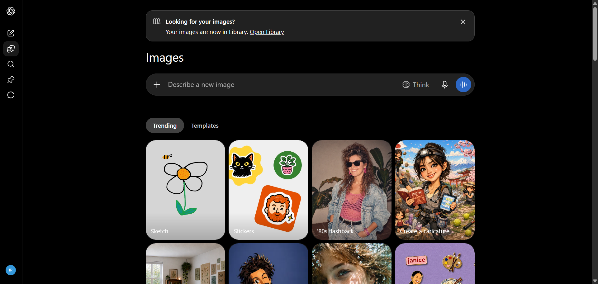

# مستندات دام: حالت سایدبار بسته (Collapsed Mode) و کنترل‌های شناور (Sidebar Collapsed State & Floating Controls)

این پوشه شامل کالبدشکافی کامل معماری DOM، استایل‌های محاسبه‌شده زنده، تصویر باکیفیت و راهنمای تزریق UI برای بخش **حالت سایدبار بسته (Collapsed Mode) و کنترل‌های شناور** می‌باشد.

---

## 📌 تصویر واقعی از محیط زنده (Real Snapshot):


---

## 🎯 سلکتورهای کلیدی (Target Selectors):
- **سلکتور کانتینر اصلی:** `div.stage-layout`
- **سلکتور تحلیل المان:** `button[aria-label="Open sidebar"]`
- **مختصات و اندازه (Bounding Box):** داینامیک / تمام صفحه

---

## 📝 توضیحات ساختاری و کاربرد:
این بخش حالت سایدبار بسته یا مینیمال ChatGPT را به همراه دکمه شناور باز کردن سایدبار (Open sidebar button)، دکمه شروع چت جدید شناور، و چیدمان تمام‌صفحه (Full-width stage layout) به تصویر می‌کشد. برای اکستنشن‌هایی که می‌خواهند از حداکثر فضای افقی استفاده کنند، ساختار DOM این حالت حیاتی است.

---

## 🛠️ راهنمای تزریق UI سفارشی در اکستنشن کروم (Extension Injection Guide):
```javascript
// تزریق تول‌بار ابزارهای شناور اختصاصی در حالت Collapsed
const openSidebarBtn = document.querySelector('button[aria-label="Open sidebar"], button[data-testid="open-sidebar-button"]');
if (openSidebarBtn && !document.getElementById('custom-floating-quick-bar')) {
  const quickBar = document.createElement('div');
  quickBar.id = 'custom-floating-quick-bar';
  quickBar.className = 'fixed left-14 top-3 z-50 flex items-center gap-2 bg-token-main-surface-secondary p-1 rounded-xl border border-token-border-default shadow-lg';
  quickBar.innerHTML = `
    <button class="p-1.5 hover:bg-token-main-surface-primary rounded-lg text-xs" title="پرامپت‌های برتر">⭐</button>
    <button class="p-1.5 hover:bg-token-main-surface-primary rounded-lg text-xs" title="حالت تمرکز">🎯</button>
    <button class="p-1.5 hover:bg-token-main-surface-primary rounded-lg text-xs" title="کپی آخرین پاسخ">📋</button>
  `;
  document.body.appendChild(quickBar);
}
```

---

## 📁 فایل‌های موجود در این دایرکتوری:
- `screenshot.png`: تصویر باکیفیت و ۱۰۰٪ واقعی از وضعیت زنده المان
- `component.html`: کد کامل DOM زنده استخراج شده از ران‌تایم کروم
- `element_metadata.json`: استایل‌های محاسبه‌شده (Computed Styles)، ویژگی‌های دسترسی‌پذیری (A11y) و ابعاد المان
- `README.md`: مستندات کامل و راهنمای فارسی توسعه و اینجکشن

---
*تولید شده توسط موتور مهندسی معکوس و مستندسازی پیشرفته McpDOM Browser*
