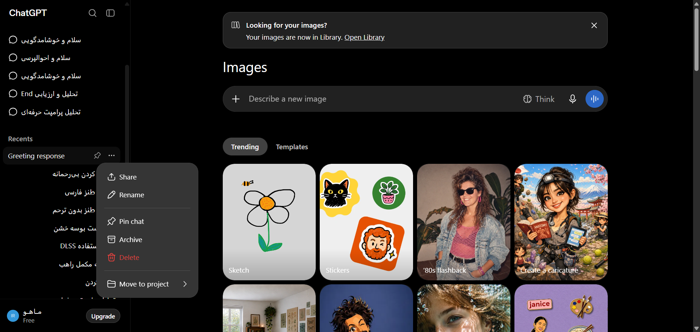

# مستندات دام: منوی سه‌نقطه گزینه‌های هر گفت‌وگو (Conversation Options Menu) (Conversation Item Context Menu (3-Dots Options))

این پوشه شامل کالبدشکافی کامل معماری DOM، استایل‌های محاسبه‌شده زنده، تصویر باکیفیت و راهنمای تزریق UI برای بخش **منوی سه‌نقطه گزینه‌های هر گفت‌وگو (Conversation Options Menu)** می‌باشد.

---

## 📌 تصویر واقعی از محیط زنده (Real Snapshot):


---

## 🎯 سلکتورهای کلیدی (Target Selectors):
- **سلکتور کانتینر اصلی:** `div[data-radix-popper-content-wrapper], div[role="menu"]`
- **سلکتور تحلیل المان:** `div[role="menu"], div[data-radix-popper-content-wrapper]`
- **مختصات و اندازه (Bounding Box):** داینامیک / تمام صفحه

---

## 📝 توضیحات ساختاری و کاربرد:
این بخش منوی شناور گزینه‌های یک گفت‌وگو در تاریخچه یا پروژه‌ها را نشان می‌دهد. شامل گزینه‌های اشتراک‌گذاری (Share)، تغییر نام (Rename)، پین کردن (Pin chat)، بایگانی (Archive)، حذف گفت‌وگو (Delete chat) و انتقال به پروژه (Move to project) است.

---

## 🛠️ راهنمای تزریق UI سفارشی در اکستنشن کروم (Extension Injection Guide):
```javascript
// تزریق گزینه اختصاصی «خروجی PDF گفت‌وگو» در منوی آیتم‌های تاریخچه
const chatMenu = document.querySelector('div[data-radix-popper-content-wrapper] [role="menu"]');
if (chatMenu && !chatMenu.dataset.pdfExportInjected) {
  chatMenu.dataset.pdfExportInjected = 'true';
  const pdfItem = document.createElement('div');
  pdfItem.className = 'flex items-center gap-2 px-3 py-2 text-sm text-token-text-primary hover:bg-token-main-surface-secondary cursor-pointer rounded-md';
  pdfItem.innerHTML = '<span>📄</span><span>دانلود چت با فرمت PDF</span>';
  pdfItem.onclick = () => alert('دانلود PDF چت آغاز شد!');
  chatMenu.appendChild(pdfItem);
}
```

---

## 📁 فایل‌های موجود در این دایرکتوری:
- `screenshot.png`: تصویر باکیفیت و ۱۰۰٪ واقعی از وضعیت زنده المان
- `component.html`: کد کامل DOM زنده استخراج شده از ران‌تایم کروم
- `element_metadata.json`: استایل‌های محاسبه‌شده (Computed Styles)، ویژگی‌های دسترسی‌پذیری (A11y) و ابعاد المان
- `README.md`: مستندات کامل و راهنمای فارسی توسعه و اینجکشن

---
*تولید شده توسط موتور مهندسی معکوس و مستندسازی پیشرفته McpDOM Browser*
