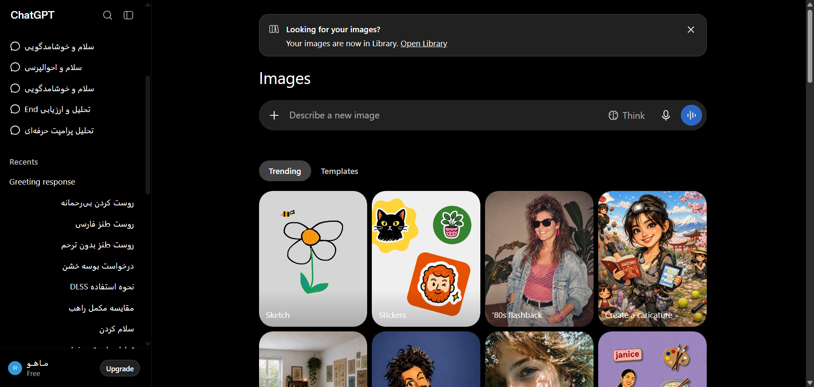

# مستندات دام: دیالوگ جستجوی گفت‌وگوها و دستورات (Search Chats Dialog) (Search Chats Modal Dialog & Command Palette)

این پوشه شامل کالبدشکافی کامل معماری DOM، استایل‌های محاسبه‌شده زنده، تصویر باکیفیت و راهنمای تزریق UI برای بخش **دیالوگ جستجوی گفت‌وگوها و دستورات (Search Chats Dialog)** می‌باشد.

---

## 📌 تصویر واقعی از محیط زنده (Real Snapshot):


---

## 🎯 سلکتورهای کلیدی (Target Selectors):
- **سلکتور کانتینر اصلی:** `div[role="dialog"], div[data-radix-popper-content-wrapper], main`
- **سلکتور تحلیل المان:** `div[role="dialog"], main`
- **مختصات و اندازه (Bounding Box):** داینامیک / تمام صفحه

---

## 📝 توضیحات ساختاری و کاربرد:
این بخش پالت جستجوی سریع چت‌ها و تاریخچه را نمایش می‌دهد. این مدال امکان فیلتر بر اساس کلمات کلیدی، نام پروژه‌ها و تاریخ گفت‌وگوها را فراهم می‌کند.

---

## 🛠️ راهنمای تزریق UI سفارشی در اکستنشن کروم (Extension Injection Guide):
```javascript
// افزودن فیلترهای هوشمند جستجو (فقط چت‌های کدنویسی، فقط پروژه‌ها)
const searchInput = document.querySelector('div[role="dialog"] input[type="search"], div[role="dialog"] input');
if (searchInput && !searchInput.dataset.smartFilterInjected) {
  searchInput.dataset.smartFilterInjected = 'true';
  const filterPills = document.createElement('div');
  filterPills.className = 'flex gap-1.5 mt-2';
  filterPills.innerHTML = `
    <span class="px-2 py-0.5 text-xs bg-token-surface-hover rounded-full cursor-pointer">💻 کدها</span>
    <span class="px-2 py-0.5 text-xs bg-token-surface-hover rounded-full cursor-pointer">📁 پروژه‌ها</span>
    <span class="px-2 py-0.5 text-xs bg-token-surface-hover rounded-full cursor-pointer">⭐ پین‌شده‌ها</span>
  `;
  searchInput.parentElement?.appendChild(filterPills);
}
```

---

## 📁 فایل‌های موجود در این دایرکتوری:
- `screenshot.png`: تصویر باکیفیت و ۱۰۰٪ واقعی از وضعیت زنده المان
- `component.html`: کد کامل DOM زنده استخراج شده از ران‌تایم کروم
- `element_metadata.json`: استایل‌های محاسبه‌شده (Computed Styles)، ویژگی‌های دسترسی‌پذیری (A11y) و ابعاد المان
- `README.md`: مستندات کامل و راهنمای فارسی توسعه و اینجکشن

---
*تولید شده توسط موتور مهندسی معکوس و مستندسازی پیشرفته McpDOM Browser*
