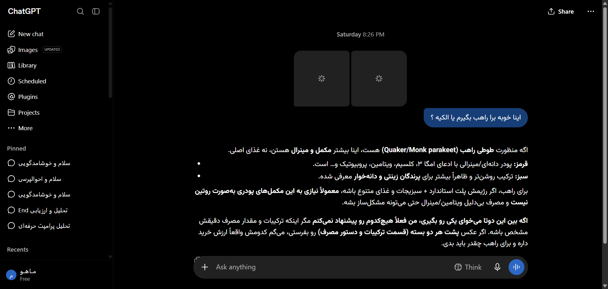

# مستندات جامع نوع پیام: جداول مارک‌داون و ساختارهای شبکه‌ای (Tables & Grids)
### Message Architecture: Markdown Tables, Headings, Lists & Blockquotes

این پوشه شامل ساختار کامل DOM، کدهای نمونه، استایل‌های محاسبه‌شده و راهنمای تزریق UI برای انواع پیام‌های **جداول مارک‌داون و ساختارهای شبکه‌ای (Tables & Grids)** می‌باشد.

---

## 📌 تصویر واقعی از این ساختار محتوایی (Real Snapshot):


---

## 🔍 کالبدشکافی ساختاری و ویژگی‌ها:
کالبدشکافی ساختار جداول مقایسه‌ای در پیام‌های چت‌جی‌پی‌تی (تگ‌های table, thead, tbody, th, td)، تیترهای H1 تا H4، نقل‌قول‌ها (Blockquotes) و لیست‌های بالت‌دار و شماره‌گذاری شده.

---

## 🎯 سلکتورهای کلیدی برای هدف‌گیری در اکستنشن:
- **کانتینر پیام:** `[data-message-author-role="assistant"], article`
- **محتوای پیام:** `.markdown.prose, [data-testid="31-message-type-rich-markdown-and-tables"]`
- **بخش اختصاصی محتوا:** `pre, code, table, img, .katex, a.citation`

---

## 🛠️ راهنمای تزریق امن رابط کاربری در اکستنشن کروم:
```javascript
// افزودن قابلیت جستجو و خروجی CSV به تمام جداول درون پیام‌ها:
document.querySelectorAll('table').forEach(table => {
  if (!table.dataset.exportTableInjected) {
    table.dataset.exportTableInjected = 'true';
    const exportBtn = document.createElement('button');
    exportBtn.className = 'btn btn-secondary text-xs px-2 py-1 my-1 rounded border';
    exportBtn.innerHTML = '📊 خروجی Excel / CSV';
    exportBtn.onclick = () => alert('جدول به صورت فایل CSV دانلود شد!');
    table.parentElement?.insertBefore(exportBtn, table);
  }
});
```

---

## 📁 فایل‌های موجود:
- `screenshot.png`: تصویر باکیفیت و زنده از این نوع پیام
- `component.html`: ساختار کامل DOM زنده استخراج شده
- `element_metadata.json`: استایل‌های محاسبه‌شده، فونت‌ها و ابعاد
- `README.md`: مستندات و راهنمای فارسی توسعه
