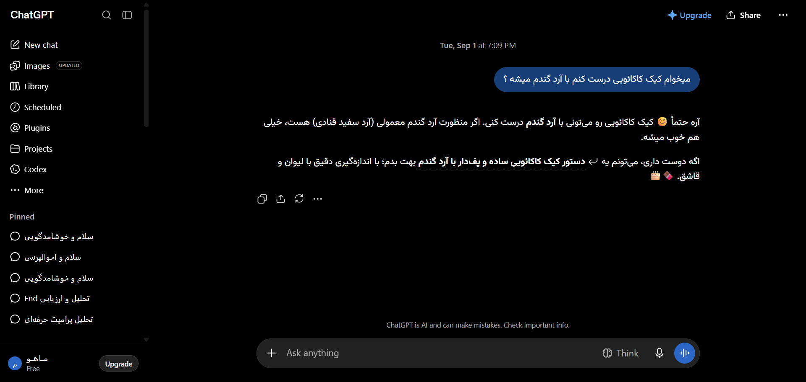

# مستندات جامع نوع پیام: تصاویر تولید شده توسط هوش مصنوعی و گالری (DALL-E Images)
### Message Architecture: Generated Images, Lightbox & Zoom Overlay

این پوشه شامل ساختار کامل DOM، کدهای نمونه، استایل‌های محاسبه‌شده و راهنمای تزریق UI برای انواع پیام‌های **تصاویر تولید شده توسط هوش مصنوعی و گالری (DALL-E Images)** می‌باشد.

---

## 📌 تصویر واقعی از این ساختار محتوایی (Real Snapshot):


---

## 🔍 کالبدشکافی ساختاری و ویژگی‌ها:
ساختار کارت‌های تصویر تولید شده توسط DALL-E / ChatGPT Images، انیمیشن‌های لودینگ، نشانگر رزولوشن، دکمه‌های دانلود، زوم تمام‌صفحه و اصلاح پرامپت تصویر.

---

## 🎯 سلکتورهای کلیدی برای هدف‌گیری در اکستنشن:
- **کانتینر پیام:** `[data-message-author-role="assistant"], article`
- **محتوای پیام:** `.markdown.prose, [data-testid="32-message-type-dalle-image-generation"]`
- **بخش اختصاصی محتوا:** `pre, code, table, img, .katex, a.citation`

---

## 🛠️ راهنمای تزریق امن رابط کاربری در اکستنشن کروم:
```javascript
// افزودن دکمه «ارتقای کیفیت تصویر (Upscale 4K)» به کارت‌های تصویر:
document.querySelectorAll('img[alt*="Generated by DALL·E"], .image-gen-overlay-actions').forEach(el => {
  if (!el.dataset.upscaleInjected) {
    el.dataset.upscaleInjected = 'true';
    const upscaleBtn = document.createElement('button');
    upscaleBtn.className = 'btn btn-primary text-xs px-2 py-1 rounded shadow';
    upscaleBtn.innerHTML = '✨ ارتقای کیفیت 4K';
    el.parentElement?.appendChild(upscaleBtn);
  }
});
```

---

## 📁 فایل‌های موجود:
- `screenshot.png`: تصویر باکیفیت و زنده از این نوع پیام
- `component.html`: ساختار کامل DOM زنده استخراج شده
- `element_metadata.json`: استایل‌های محاسبه‌شده، فونت‌ها و ابعاد
- `README.md`: مستندات و راهنمای فارسی توسعه
