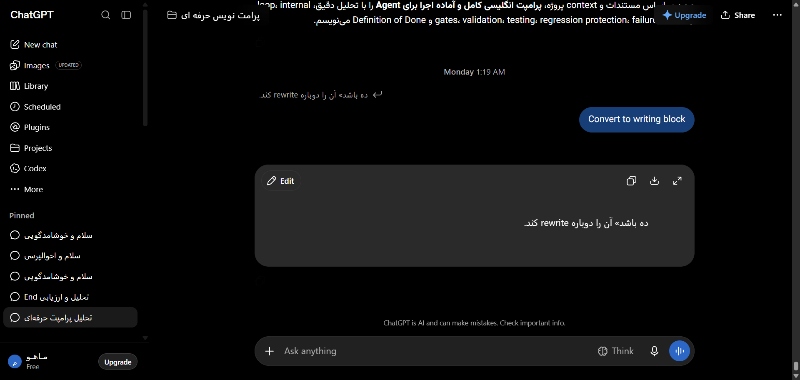

# مستندات جامع نوع پیام: فرایند تفکر و استدلال عمیق (o1/o3 Thinking Trace)
### Message Architecture: Collapsible Reasoning Process & Chain-of-Thought Logs

این پوشه شامل ساختار کامل DOM، کدهای نمونه، استایل‌های محاسبه‌شده و راهنمای تزریق UI برای انواع پیام‌های **فرایند تفکر و استدلال عمیق (o1/o3 Thinking Trace)** می‌باشد.

---

## 📌 تصویر واقعی از این ساختار محتوایی (Real Snapshot):


---

## 🔍 کالبدشکافی ساختاری و ویژگی‌ها:
ساختار باکس آکاردئونی تفکر مدل‌های استدلالی (مانند o1 و o3-mini)، تایمر مدت زمان استدلال (Thought for X seconds)، انیمیشن پالس تفکر و متن استدلال زنجیره‌ای.

---

## 🎯 سلکتورهای کلیدی برای هدف‌گیری در اکستنشن:
- **کانتینر پیام:** `[data-message-author-role="assistant"], article`
- **محتوای پیام:** `.markdown.prose, [data-testid="35-message-type-collapsible-thinking-reasoning"]`
- **بخش اختصاصی محتوا:** `pre, code, table, img, .katex, a.citation`

---

## 🛠️ راهنمای تزریق امن رابط کاربری در اکستنشن کروم:
```javascript
// باز نگه داشتن دائمی یا ذخیره لاگ تفکر مدل در فایل متنی:
document.querySelectorAll('[data-testid*="thought"], button[aria-expanded]').forEach(toggle => {
  if (toggle.textContent.includes('Thought')) {
    toggle.click(); // باز کردن خودکار
  }
});
```

---

## 📁 فایل‌های موجود:
- `screenshot.png`: تصویر باکیفیت و زنده از این نوع پیام
- `component.html`: ساختار کامل DOM زنده استخراج شده
- `element_metadata.json`: استایل‌های محاسبه‌شده، فونت‌ها و ابعاد
- `README.md`: مستندات و راهنمای فارسی توسعه
