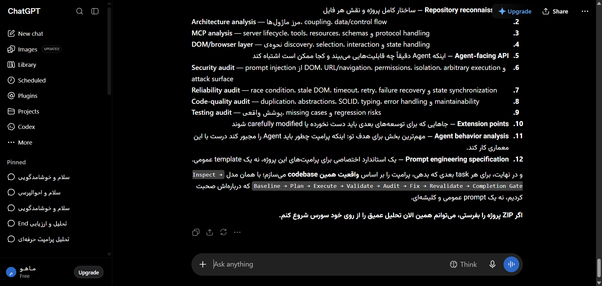

# مستندات جامع نوع پیام: فرمول‌های ریاضی و نمادهای لاتک (Math & KaTeX Formulas)
### Message Architecture: KaTeX Math Equations, Formulas & Inline Symbols

این پوشه شامل ساختار کامل DOM، کدهای نمونه، استایل‌های محاسبه‌شده و راهنمای تزریق UI برای انواع پیام‌های **فرمول‌های ریاضی و نمادهای لاتک (Math & KaTeX Formulas)** می‌باشد.

---

## 📌 تصویر واقعی از این ساختار محتوایی (Real Snapshot):


---

## 🔍 کالبدشکافی ساختاری و ویژگی‌ها:
ساختار رندرینگ فرمول‌های پیچیده ریاضی، فیزیک و آمار به وسیله موتور KaTeX (کلاس‌های .katex, .katex-display, .katex-html) و سازگاری با صفحه خوان‌ها.

---

## 🎯 سلکتورهای کلیدی برای هدف‌گیری در اکستنشن:
- **کانتینر پیام:** `[data-message-author-role="assistant"], article`
- **محتوای پیام:** `.markdown.prose, [data-testid="37-message-type-math-and-latex-formulas"]`
- **بخش اختصاصی محتوا:** `pre, code, table, img, .katex, a.citation`

---

## 🛠️ راهنمای تزریق امن رابط کاربری در اکستنشن کروم:
```javascript
// افزودن دکمه کپی کد خام فرمول LaTeX:
document.querySelectorAll('.katex-display').forEach(eq => {
  eq.title = 'برای کپی کد LaTeX کلیک کنید';
});
```

---

## 📁 فایل‌های موجود:
- `screenshot.png`: تصویر باکیفیت و زنده از این نوع پیام
- `component.html`: ساختار کامل DOM زنده استخراج شده
- `element_metadata.json`: استایل‌های محاسبه‌شده، فونت‌ها و ابعاد
- `README.md`: مستندات و راهنمای فارسی توسعه
