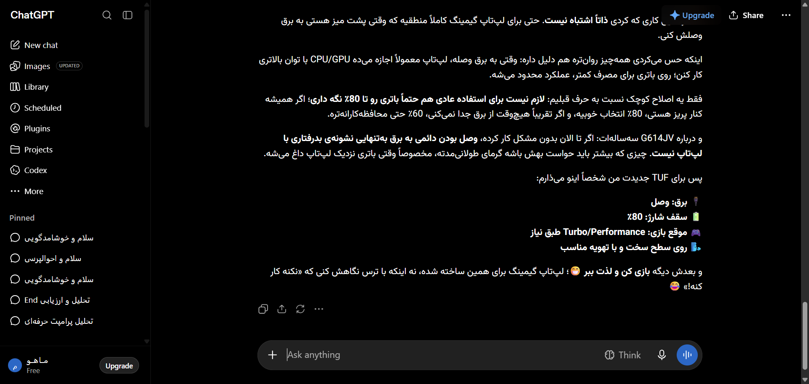

# مستندات جامع نوع پیام: گفتگوی چند نوبته و محتوای ترکیبی (Composite Multi-Turn Chat)
### Message Architecture: Multi-Turn Conversation & Complex Mixed Messages

این پوشه شامل ساختار کامل DOM، کدهای نمونه، استایل‌های محاسبه‌شده و راهنمای تزریق UI برای انواع پیام‌های **گفتگوی چند نوبته و محتوای ترکیبی (Composite Multi-Turn Chat)** می‌باشد.

---

## 📌 تصویر واقعی از این ساختار محتوایی (Real Snapshot):


---

## 🔍 کالبدشکافی ساختاری و ویژگی‌ها:
ساختار کامل یک پیام ترکیبی عظیم شامل متن پاراگرافی، ۲ بلوک کد مختلف، ۱ جدول مقایسه‌ای، فرمول‌های ریاضی و نقل‌قول‌های متنی در یک پاسخ واحد.

---

## 🎯 سلکتورهای کلیدی برای هدف‌گیری در اکستنشن:
- **کانتینر پیام:** `[data-message-author-role="assistant"], article`
- **محتوای پیام:** `.markdown.prose, [data-testid="38-message-type-multi-turn-composite-conversation"]`
- **بخش اختصاصی محتوا:** `pre, code, table, img, .katex, a.citation`

---

## 🛠️ راهنمای تزریق امن رابط کاربری در اکستنشن کروم:
```javascript
// تزریق ناوبری درون‌متنی (Table of Contents) برای پیام‌های بسیار طولانی:
const headings = document.querySelectorAll('.markdown h2, .markdown h3');
```

---

## 📁 فایل‌های موجود:
- `screenshot.png`: تصویر باکیفیت و زنده از این نوع پیام
- `component.html`: ساختار کامل DOM زنده استخراج شده
- `element_metadata.json`: استایل‌های محاسبه‌شده، فونت‌ها و ابعاد
- `README.md`: مستندات و راهنمای فارسی توسعه
