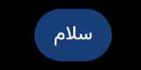

# مستندات جامع نوع پیام: استایل پیام‌های کاربر و ویرایشگر (User Prompt Bubbles)
### Message Architecture: User Prompts, RTL Styling & In-Place Editor Mode

این پوشه شامل ساختار کامل DOM، کدهای نمونه، استایل‌های محاسبه‌شده و راهنمای تزریق UI برای انواع پیام‌های **استایل پیام‌های کاربر و ویرایشگر (User Prompt Bubbles)** می‌باشد.

---

## 📌 تصویر واقعی از این ساختار محتوایی (Real Snapshot):


---

## 🔍 کالبدشکافی ساختاری و ویژگی‌ها:
ساختار حباب پیام ارسالی توسط کاربر، استایل راست‌به‌چپ (RTL) فارسی، دکمه مداد جهت ویرایش درجا (Edit prompt) و ترنزیشن ذخیره و انصراف.

---

## 🎯 سلکتورهای کلیدی برای هدف‌گیری در اکستنشن:
- **کانتینر پیام:** `[data-message-author-role="assistant"], article`
- **محتوای پیام:** `.markdown.prose, [data-testid="40-message-type-user-prompt-styles"]`
- **بخش اختصاصی محتوا:** `pre, code, table, img, .katex, a.citation`

---

## 🛠️ راهنمای تزریق امن رابط کاربری در اکستنشن کروم:
```javascript
// ذخیره پرامپت در گنجینه پرامپت‌های برتر کاربر:
```

---

## 📁 فایل‌های موجود:
- `screenshot.png`: تصویر باکیفیت و زنده از این نوع پیام
- `component.html`: ساختار کامل DOM زنده استخراج شده
- `element_metadata.json`: استایل‌های محاسبه‌شده، فونت‌ها و ابعاد
- `README.md`: مستندات و راهنمای فارسی توسعه
