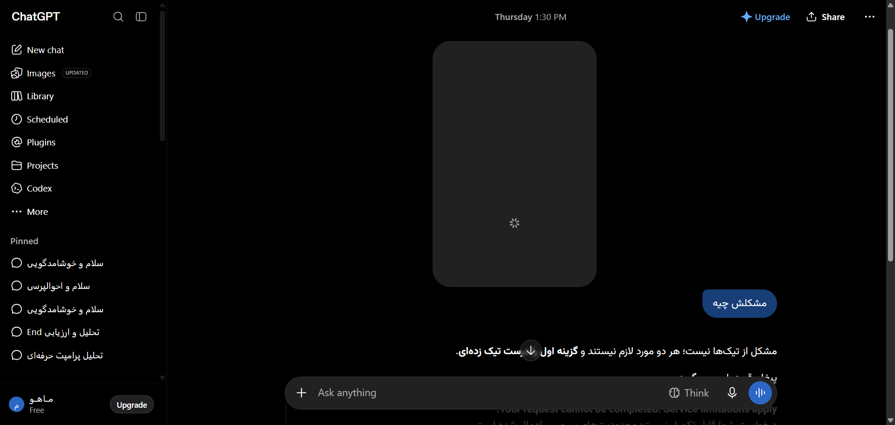

# مستندات جامع نوع پیام: وضعیت‌های خطا، محدودیت و دکمه تلاش مجدد (Error & Retry States)
### Message Architecture: Network Error Alerts, Rate Limits & Retry Triggers

این پوشه شامل ساختار کامل DOM، کدهای نمونه، استایل‌های محاسبه‌شده و راهنمای تزریق UI برای انواع پیام‌های **وضعیت‌های خطا، محدودیت و دکمه تلاش مجدد (Error & Retry States)** می‌باشد.

---

## 📌 تصویر واقعی از این ساختار محتوایی (Real Snapshot):


---

## 🔍 کالبدشکافی ساختاری و ویژگی‌ها:
ساختار هشدارهای خطای شبکه، محدودیت سهمیه مدل (Rate Limit Notice)، دکمه Try Again و باکس قرمز/نارنجی خطاهای ران‌تایم.

---

## 🎯 سلکتورهای کلیدی برای هدف‌گیری در اکستنشن:
- **کانتینر پیام:** `[data-message-author-role="assistant"], article`
- **محتوای پیام:** `.markdown.prose, [data-testid="41-message-type-error-and-retry-states"]`
- **بخش اختصاصی محتوا:** `pre, code, table, img, .katex, a.citation`

---

## 🛠️ راهنمای تزریق امن رابط کاربری در اکستنشن کروم:
```javascript
// سیستم تلاش مجدد خودکار (Auto-Retry on Error):
```

---

## 📁 فایل‌های موجود:
- `screenshot.png`: تصویر باکیفیت و زنده از این نوع پیام
- `component.html`: ساختار کامل DOM زنده استخراج شده
- `element_metadata.json`: استایل‌های محاسبه‌شده، فونت‌ها و ابعاد
- `README.md`: مستندات و راهنمای فارسی توسعه
