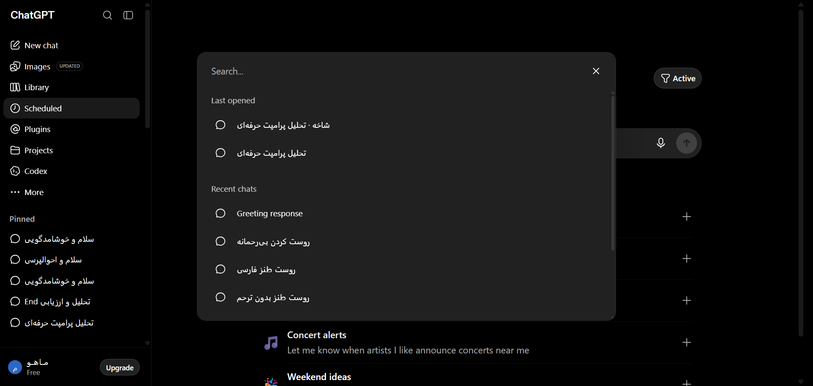

# مستندات کامل: پنجره جستجوی چت‌ها و پالت فرمان (Search Dialog)
### Search Chats Modal & Command Palette Architecture

این بخش دیالوگ مودال سرچ چت‌جی‌پی‌تی را که با کلید میانبر `Ctrl+K` یا آیکون جستجوی سایدبار باز می‌شود، به صورت کامل مستند کرده است.

---

## 📌 تصویر واقعی از پنجره سرچ:


---

## 🔍 تحلیل کالبدشکافی ساختار DOM:
- **کانتینر مودال:** `div[role="dialog"][aria-modal="true"]`
- **فیلد ورودی جستجو:** `input[type="text"][placeholder="Search..."]`
- **دکمه بستن پنجره:** `button[aria-label="Close"], button svg`
- **گروه‌بندی چت‌های اخیر:** `div.text-xs.font-semibold:contains("Last opened")`
- **آیتم‌های نتایج:** `a[href*="/c/"], div[role="option"]`

---

## 🛠️ راهنمای تزریق اکستنشن (فیلترهای اختصاصی، سرچ پیشرفته بر اساس برچسب):
```javascript
// تزریق دکمه فیلترهای پیشرفته به هدر دیالوگ سرچ
const searchInput = document.querySelector('input[placeholder="Search..."]');
if (searchInput && !searchInput.dataset.advancedFilterInjected) {
  searchInput.dataset.advancedFilterInjected = 'true';
  const filterBadge = document.createElement('div');
  filterBadge.className = 'flex gap-1 ml-2 text-xs';
  filterBadge.innerHTML = `
    <button class="px-2 py-0.5 rounded bg-blue-600/20 text-blue-400 border border-blue-500/30">#کدها</button>
    <button class="px-2 py-0.5 rounded bg-purple-600/20 text-purple-400 border border-purple-500/30">#عکس‌ها</button>
    <button class="px-2 py-0.5 rounded bg-green-600/20 text-green-400 border border-green-500/30">#فایل‌ها</button>
  `;
  searchInput.parentElement?.appendChild(filterBadge);
}
```
