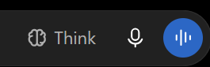

# مستندات کامل: میکروفون ورودی ویس و تبدیل گفتار به متن (Voice Input)
### Voice Input Microphone Button & Web Speech Dictation

این بخش ساختار دقیق دکمه میکروفون در فیلد کامپوزر پیام، انیمیشن‌های ضبط زنده و پروتکل ارسال استریم صوت را مستندسازی کرده است.

---

## 📌 تصویر واقعی دکمه میکروفون در رابط کاربری:


---

## 🔍 تحلیل کالبدشکافی ساختار DOM:
- **دکمه میکروفون ورودی:** `button[data-testid="composer-speech-button"], button[aria-label*="voice"]`
- **آیکون میکروفون:** `svg path[d="M12 1a3 3 0 0 0-3 3v8a3 3 0 0 0 6 0V4a3 3 0 0 0-3-3z"]`
- **وضعیت درحال ضبط (Pulsing):** `button.recording-active, div.waveform`
- **تکنولوژی‌های مرورگر:** Web Speech API (`webkitSpeechRecognition`) و MediaStream Audio API.

---

## 🛠️ راهنمای تزریق اکستنشن (ضبط ویس با کیفیت بالا و ارسال مستقیم به Whisper API):
```javascript
// شنود کلیک روی دکمه میکروفون یا افزودن میکروفون اختصاصی به ادیتور
const micBtn = document.querySelector('[data-testid="composer-speech-button"]');
if (micBtn) {
  micBtn.addEventListener('click', () => {
    console.log('🎤 ورودی صوتی فعال شد');
  });
}
```
