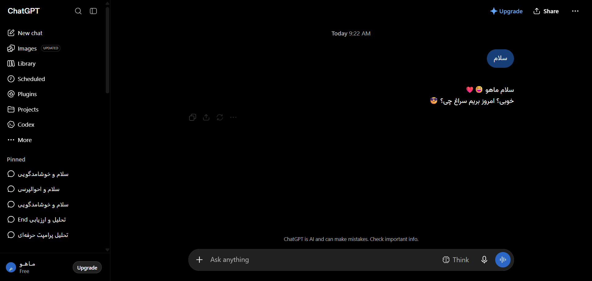

# مستندات چت زنده: Greeting response
### Chat Thread #05: thread-05-greeting-response

- **دسته‌بندی محتوایی:** English Greeting & Formatting
- **آدرس مستقیم در پلتفرم:** `https://chatgpt.com/c/6aa0f41d-9d70-83eb-839f-8882fbbfe43e`
- **تاریخ استخراج زنده:** 2026-09-09T14:22:30.419Z

---

## 📌 تصویر واقعی از این گفت‌وگو (Real Live Snapshot):


---

## 🔍 تحلیل کالبدشکافی المان‌های این چت:
- **کانتینر اصلی پیام‌ها:** `main div.flex-1.overflow-hidden, main article`
- **حباب پیام‌های کاربر:** `[data-message-author-role="user"]`
- **پاسخ‌های دستیار هوش مصنوعی:** `[data-message-author-role="assistant"], .markdown.prose`
- **بلوک‌های کد و سینتکس هایلایت:** `pre, code, div.bg-token-main-surface-secondary`
- **جداول و ساختارهای مقایسه‌ای:** `table.w-full, thead, tbody, tr, th, td`

---

## 🛠️ راهنمای تزریق امن رابط کاربری در این چت:
```javascript
// تزریق تول‌بار اختصاصی به انتهای پیام‌های این گفتگو
const assistantMessages = document.querySelectorAll('[data-message-author-role="assistant"]');
assistantMessages.forEach((msg, idx) => {
  if (!msg.dataset.customToolbarInjected) {
    msg.dataset.customToolbarInjected = 'true';
    const customBar = document.createElement('div');
    customBar.className = 'my-custom-message-toolbar flex gap-2 mt-2 pt-2 border-t border-token-border-default text-xs';
    customBar.innerHTML = `
      <button class="px-2 py-1 bg-token-surface-hover rounded">📥 ذخیره پیام ${idx + 1}</button>
      <button class="px-2 py-1 bg-token-surface-hover rounded">🔊 خواندن صوتی</button>
      <button class="px-2 py-1 bg-token-surface-hover rounded">✨ ترجمه به انگلیسی</button>
    `;
    msg.appendChild(customBar);
  }
});
```
