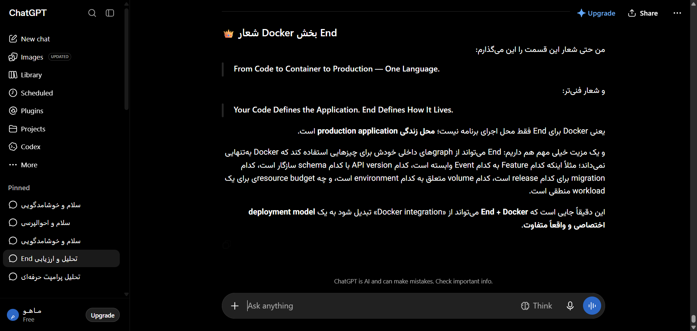

# مستندات چت زنده: فضای کدنویسی و توسعه Codex
### Chat Thread #30: thread-30-codex-workspace

- **دسته‌بندی محتوایی:** Developer Canvas & Code Execution
- **آدرس مستقیم در پلتفرم:** `https://chatgpt.com/codex`
- **تاریخ استخراج زنده:** 2026-09-09T14:32:59.738Z

---

## 📌 تصویر واقعی از این گفت‌وگو (Real Live Snapshot):


---

## 🔍 تحلیل کالبدشکافی المان‌های این چت:
- **کانتینر اصلی کد و کانواس:** `main div.flex-1.overflow-hidden, .codex-canvas`
- **حباب پیام‌های کاربر:** `[data-message-author-role="user"]`
- **پاسخ‌های دستیار و بلوک‌های ران‌تایم:** `[data-message-author-role="assistant"], pre, code`
- **ترمینال خروجی و اجرای زنده:** `div.terminal-output-container`

---

## 🛠️ راهنمای تزریق امن رابط کاربری در این چت:
```javascript
// تزریق دکمه خروجی پروژه به محیط کدکس
const codexContainer = document.querySelector('main');
if (codexContainer && !codexContainer.dataset.exportInjected) {
  codexContainer.dataset.exportInjected = 'true';
  const btn = document.createElement('button');
  btn.className = 'btn btn-primary fixed top-4 right-4 z-50 px-3 py-2 text-sm rounded shadow';
  btn.innerHTML = '📦 دانلود سورس کد پروژه';
  document.body.appendChild(btn);
}
```
