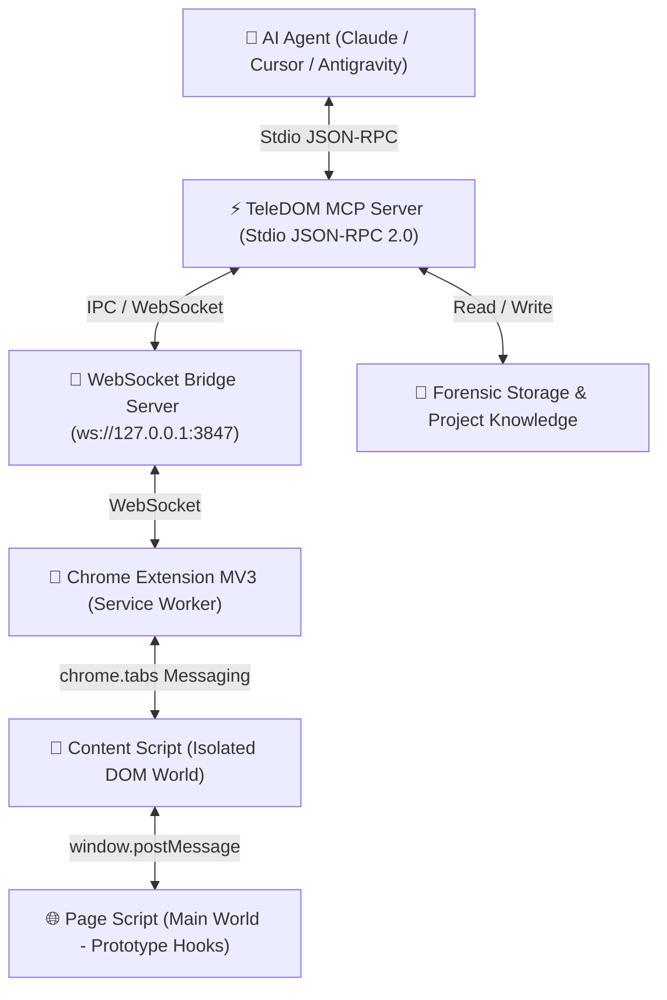

# 🏗️ Architecture Deep Dive — TeleDOM Platform

TeleDOM is built on a **Dual-Environment Clean Architecture** that bridges high-level AI reasoning with low-level browser runtime environments.

---

## 📐 Dual-Environment Execution Model

---

## 🏛️ Subsystems

### 1. Model Context Protocol (MCP) Server
- Implements JSON-RPC 2.0 over standard I/O (Stdio).
- Exposes **121 tools** categorized across 15 functional domains.
- Automatically handles dynamic tool discovery (`get_tool_groups`, `get_tool_catalog`).
- Maintains zero-leak process lifecycle with auto-bridge negotiation.

### 2. Zero-Config On-Demand Auto-Bridge (`MCPBridgeServer`)
- Runs a dedicated WebSocket + HTTP server on `127.0.0.1:3847`.
- Automatically connects newly opened browser tabs when the Chrome extension is active.
- If port 3847 is already occupied by a standing background bridge, it cleanly attaches via HTTP fallback.
- Detects stale sockets and maintains client registry across tab navigations.

### 3. Chrome Extension Manifest V3 (`src/extension/`)
- **Service Worker (`service-worker.js`)**: Authoritative tab manager with `chrome.tabs`, `chrome.scripting`, and `chrome.debugger` capabilities.
- **Content Script (`content-script.js`)**: Injected into every frame at `document_start` to observe DOM mutations, calculate element geometry, and handle synthetic events.
- **Page Script (`page-script.js`)**: Injected into the main world to intercept console errors and fetch/XHR network requests without sandbox isolation.

### 4. Deterministic Time-Travel & Diff Engine (`src/reconstruction/` & `src/diff/`)
- Reconstructs complete DOM snapshots at sub-millisecond timestamps by replaying mutation deltas on base checkpoints.
- Computes structural tree diffs (additions, removals, attribute changes, moves) using stable node hashes.
- Detects disappearing elements and performs root-cause analysis (`why_did_element_disappear`).

### 5. DOM Mutation & Transaction Engine (`src/core/dom-mutation-engine.ts`)
- Provides first-class, transactional DOM mutation primitives (`insert_html`, `remove_element`, `set_attribute`, etc.).
- Maintains immutable undo/redo history stacks.
- Guarantees automatic rollback when a step in a multi-mutation transaction fails.

### 6. Reverse-Engineering & Project Knowledge Engine (`src/projects/`)
- Captures isolated UI regions into self-contained component packages.
- Strips extension artifacts and applies PII redaction rules.
- Generates reconstruction specs and relationship graphs for rebuilding web pages as clean modular React components.
